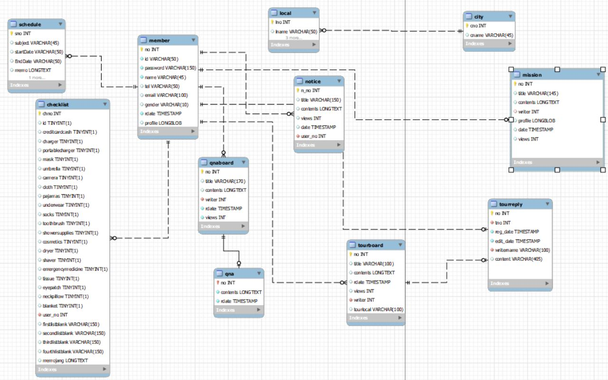

# TeamProject 어디가지 ?  []

:banana: **목차** 
1. [소개](#소개)
2. [기능](#기능)
3. [개발환경](#개발환경)
4. [테이블 구조 ](#테이블-구조) 

## :dog2: 소개  

기존 사이트들은 예약 서비스를 중점적으로 이루어져 있습니다.  
사용자가 여행지에서 탐색할 수 있는 숙소, 관광지, 맛집 등을 한 눈에 볼 수 있는 서비스를 제공하고, 여행 일정을 계획하는 것이 중점인 사이트 '어디가지?' 프로젝트를 기획했습니다. 
  
  > 현재 강원도 속초시만 방문이 가능하며, 추후 여러 기능이 업데이트 될 예정입니다.  

 

## :books: 기능 

 * mian 1~2페이지 
   > 여행하고 싶은 지역을 선택하는 페이지 입니다. 

  * 회원  
     - 가입  
     - 정보수정  
     - 탈퇴  
     - 아이디/비밀번호 찾기
       > 비밀번호의 경우 임시비밀번호를 발급하도록 구현
       

  * 게시판  (작성, 수정, 삭제, 검색)  
    :taxi: QnA  
    > 회원이 작성한 게시글에 관리자만 답글을 등록할 수 있습니다.(ajax 비동기 방식 사용) 
   
    :mailbox: 공지사항  
    > 회원이 아니라도 확인할 수 있는 공지사항 페이지입니다  
   
    :calendar: 랜선투어  
    > 여행을 다녀온 회원들의 여행지 추천 게시글 작성 및 댓글 작성이 가능한 페이지 입니다.
   
    
    :video_game: 미션룸    
     >  매주 업데이트 되는 미션을 완수 하면 보상을 받을 수 있는 이벤트 페이지 
     

* :sun_with_face: 날씨  
     >   지역별 현재 날씨 확인 가능 (기상청 opne API 사용)

 *   :statue_of_liberty: 인기여행지     
     > 랜선투어의 게시글 작성 시 제일 많이 선택한 지역별로 메인페이지 하단에 나타납니다.   

*    :calendar: 일정 계획표  
     > 캘린더에 일정 추가 및 삭제- fullcalendar API 사용

*    :calendar: 체크리스트  
      > 여행 시 꼭 필요한 물건 체크 리스트 제공

* 관리자
    > 공지 사항 작성, 수정, 삭제  
    > Qna 답글 등록

 

## :computer: 개발 환경  
>Language : JAVA 1.8  
Framework : Spring 5.0.2.RELEASE, BootStrap, MyBatis  
WEB Server : Apache  
WAS Server : Tomcat 8.5  
build tool : maven 3.6.3  
DB : MySQL 8.0.27

## :curly_loop: 테이블 구조   

  

